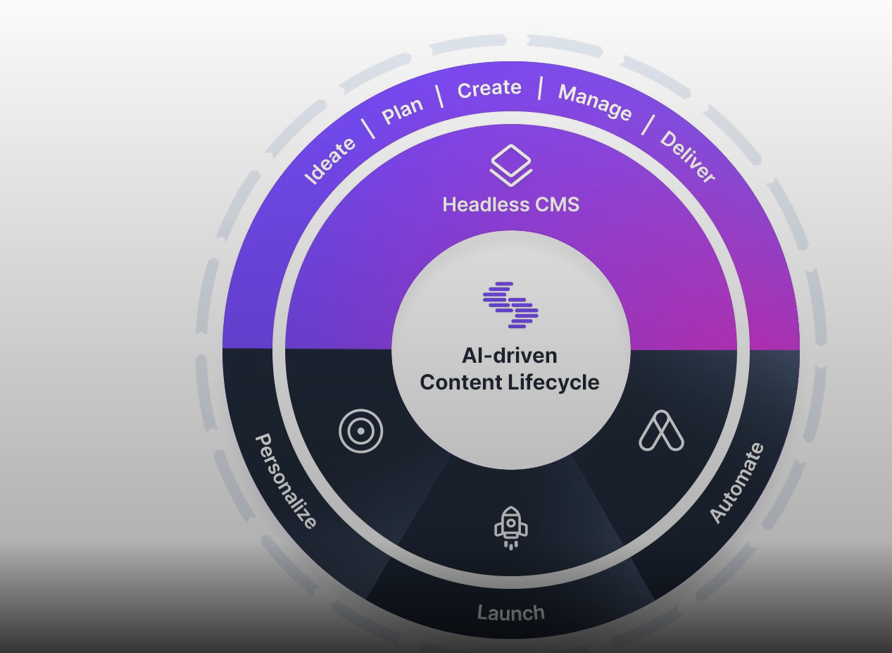
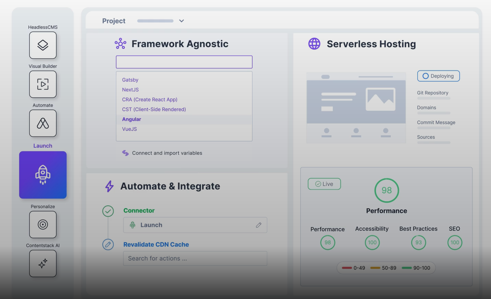
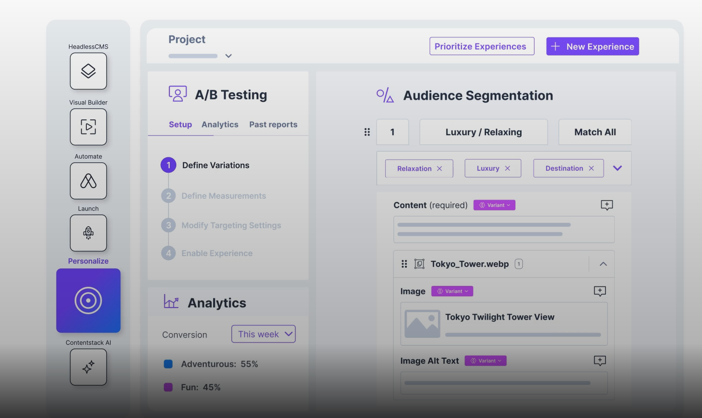
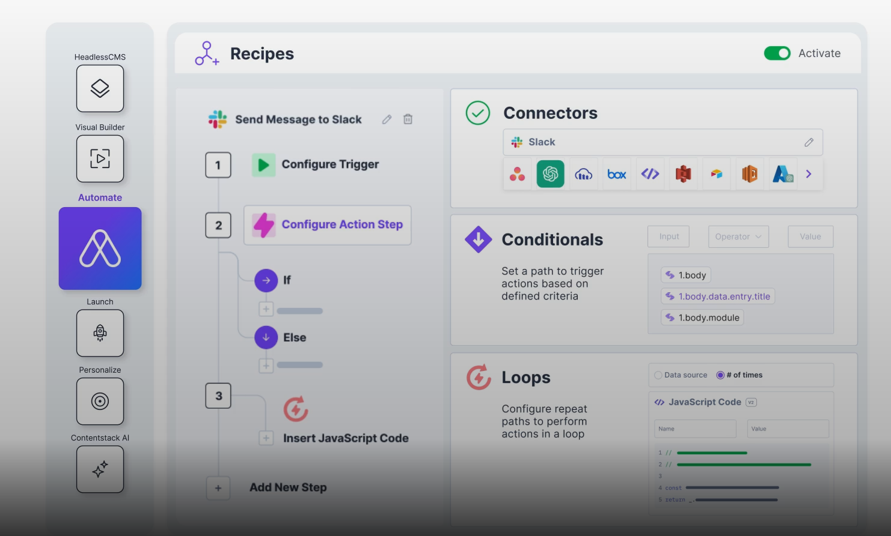

## What is Contentstack?

- **Enterprise-grade headless Content Management System (CMS)**\
  A backend-only CMS that separates content creation from presentation, delivering content via APIs to any device or platform without a built-in frontend.&#x20;

- **Central component of a Digital Experience Platform (DXP)**\
  A modular, API-first architecture—including REST APIs, SDKs, and GraphQL support—enabling integration with various digital experience tools.

- **Built on principles like JAMstack and MACH**\
  A composable tech stack is a flexible, best-of-breed collection of modular technologies (like microservices, APIs, SaaS tools) that can be mixed, matched, and scaled to meet specific business needs.

---

## Features

- Delivers content across diverse channels.

- Aims to decouple backend content management from frontend presentation.

- Requires governance controls and role-based access.

- Values speed, scalability, and enterprise-grade reliability.

---

## Users of Contentstack

- MongoDB

- Mattel

---

# Complete Content Lifecycle

---

# Tools of Contentstack

### 1. **Launch**

- Hosting options that make content deployment straightforward\
  \
   

---

### 2. **Personalize**

- Tailor content to specific audiences\
  \
   

---

### 3. **Automate**

- Visual workflow builder for implementing automation of CMS processes\
  \
   

---

### 4. **Visual Builder**

- Visually edit and manage content
