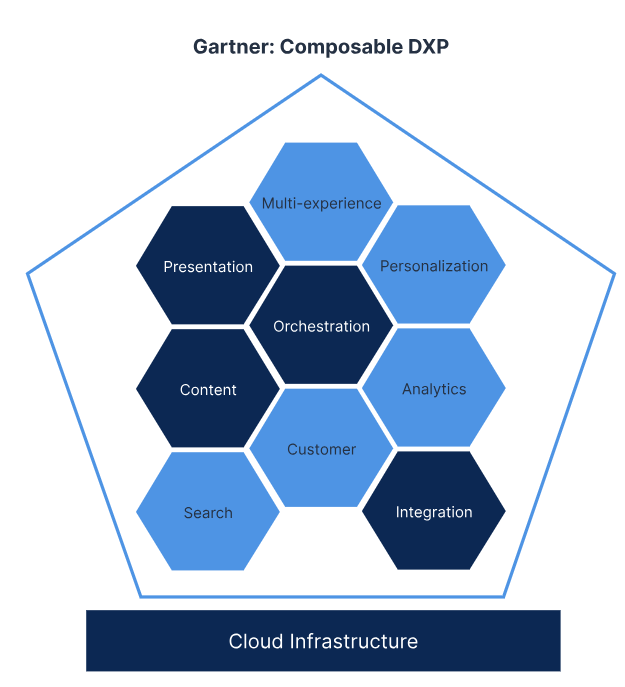
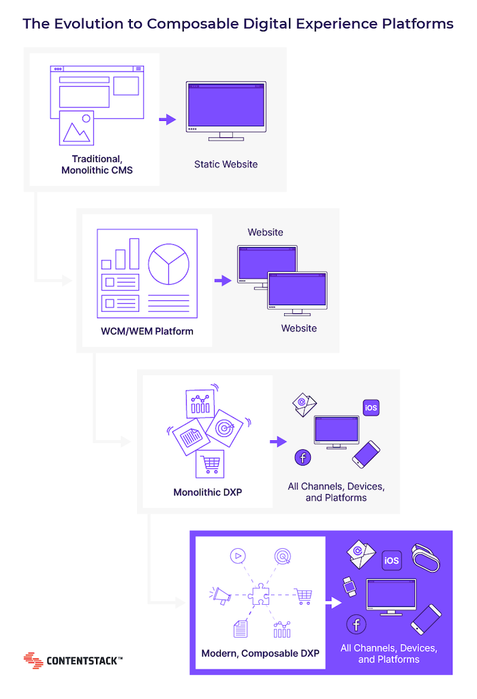
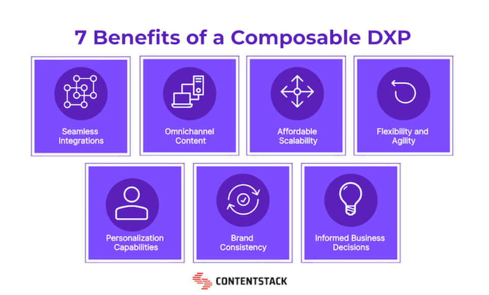
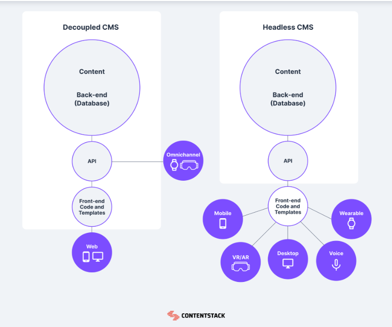
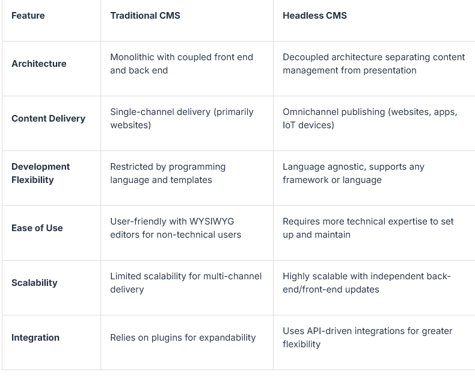

# What is **Composable**

- Application leaders cannot meet market needs or business objectives with monolithic digital experience.
- To future-proof the stack, a **composable DXP** must be used to deliver composable user experiences.
- Follows more of a microservices approach to the DXP space — and it's only possible with the foundation of a **headless CMS**.

**Visual Context:**
The architecture images above illustrate the modular and integrated nature of composable DXPs, combining diverse services into a unified ecosystem.

---

## Infrastructure

---

## Why **DXP**?

Monolithic suites struggle to keep up with the rapidly evolving demands of today’s digital consumers. After-market add-ons and accumulated technical debt often lock organizations into outdated vendor relationships, hindering innovation and competitiveness.

---

## **MACH** Principles

- **Microservices**
- **API connectivity**
- **Cloud-native**
- **Headless** infrastructure

These core principles support flexible, scalable, and future-proofed digital experience platforms.

---

## Benefits of DXP

This diagram visually showcases the key advantages of adopting a DXP—scalability, agility, improved integration, and enhanced user experience.

---

## Headless vs. Decoupled **CMS**

- A **decoupled CMS** includes an _optional_ built‑in frontend presentation layer alongside its API, whereas a **headless CMS** is purely backend‑only and delivers content solely via APIs.
- It diverges from traditional CMS platforms like WordPress, where back and front end are merged.
- While traditional monolithic CMSes limit content display flexibility, a headless CMS acts as a neutral platform: it stores your content and grants you complete control over how it’s presented.

**Example Illustration:**

---

## Traditional vs. Headless CMS

This graphic juxtaposes the tightly coupled traditional CMS architecture with the flexible, API-driven headless model.

---

### Quick One-Liner Refinement

**Headless CMS vs. Decoupled CMS (one-liner):**
“A decoupled CMS offers both backend content management and an optional native frontend, while a headless CMS is backend-only and serves content through APIs with no frontend presentation.”

---
