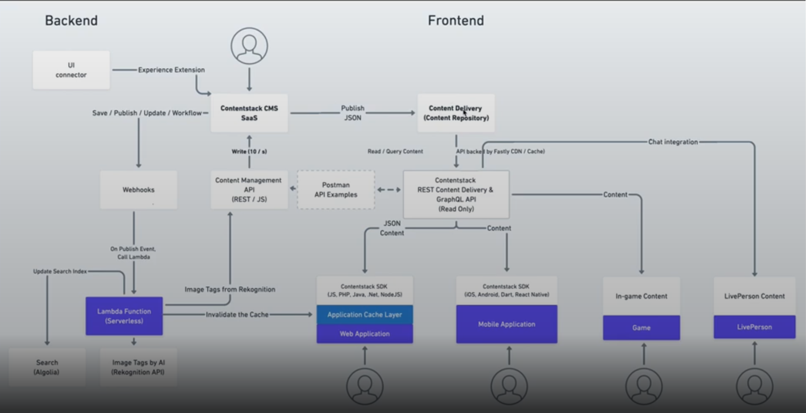
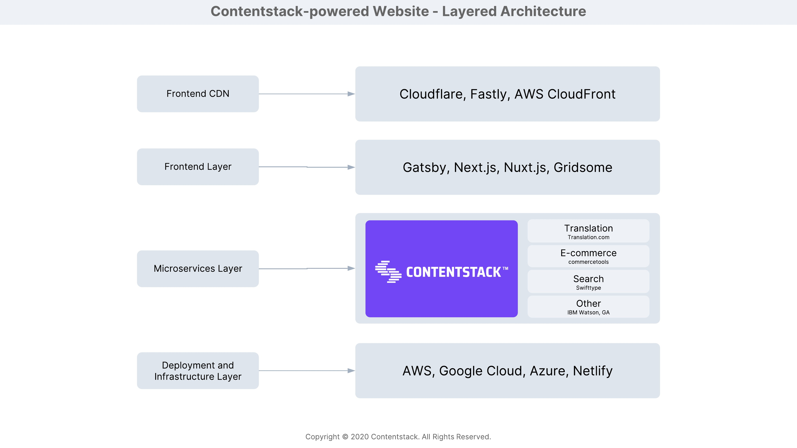
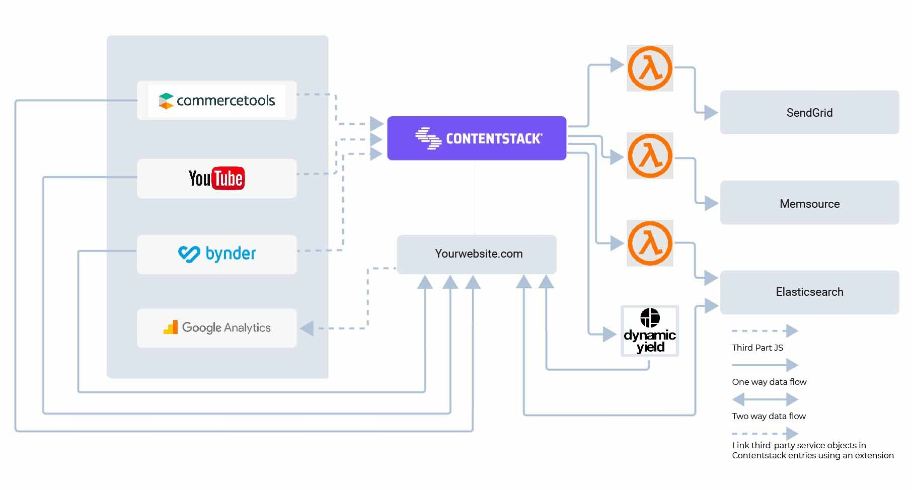

## Contentstack Architecture

1. Contentstack stores and manages content in its SaaS headless CMS backend, then delivers it in **JSON format** to its Content Delivery System (CDS).

2. Content is accessed through read-only APIs, including both **REST** and **GraphQL**, and supported by a range of SDKs:

   - **Frontend**: JavaScript, PHP, Node.js

   - **Mobile**: iOS, Android, and React Native

3. Beyond traditional web and mobile apps, the content can also be integrated into game engines, chat applications, AR/VR platforms, and more.

4. To illustrate usage, Contentstack provides **Postman collections** with sample API calls.

5. On the backend, once a user creates or publishes content in the CMS, it's pushed to the CDS for distribution.

6. The platform supports **extensions** and a **marketplace** to connect with third-party tools—like e-commerce platforms or search engines—enhancing functionality.

7. To automate workflows, **webhooks** can trigger serverless functions on events like "save" or "publish":

8. These serverless functions can implement AI-based tasks (e.g., image tagging via Amazon Recognition), update search indices (e.g., Algolia), or flush caches.

9. Introduced more recently, **Automation Hub** (Contentstack’s low-code/no-code tool) complements webhooks—listening to events like save, publish, or update—and enables automated workflows without writing functions.

---

# Layer-wise Architecture

**Diagram:**

To create a simple website using Contentstack as its CMS, your architecture can be broken down into the following four layers, with each layer serving a different purpose:

---

### 1. **Deployment and Infrastructure Layer**

- Hosts your application (e.g., Amazon S3, etc.)

---

### 2. **Microservices Layer**

- Content translation services (for multilingual websites)
- E-commerce and cart services – Shopify
- Search functionality – Elastic Search
- Digital Asset Management – Cloudinary

---

### 3. **Frontend or Presentation Layer**

- The presentation layer fetches content from Contentstack using Content Delivery APIs and renders it the way you want.

---

### 4. **Frontend CDN Layer**

- Helps render content to your client quickly and without any lag.
- CDN services store caches of content in data centers around the world. All subsequent page requests are served from the nearest cache data center.
- You can define your custom cache purge policy based on how often you want to clear out the cache and make way for new (fresh or updated) content.

---

# MACH Architecture

**Diagram:**

- The AWS Lambda in the architecture diagram represents the **“microservice”** component of MACH.
- The communication between the systems happens through the **APIs** (REST or GraphQL). The arrows in the diagram represent this communication and form the **“API-first”** component.

---
