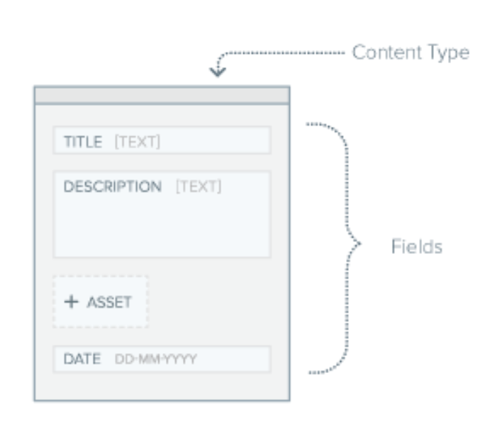
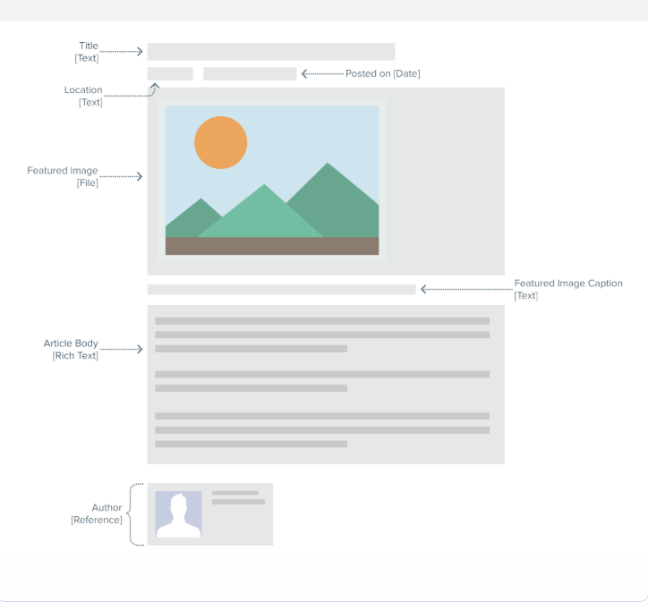
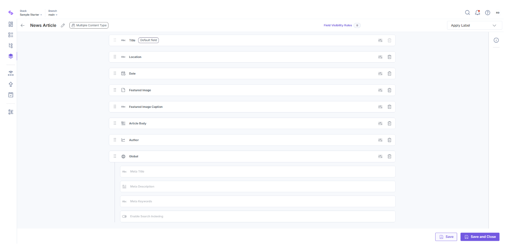

# Content Modeling

- Defining the structure of the content

## Good Practices for Content Modeling

- Content is reusable
- It’s scalable
- Seamlessly integrates with APIs, SDKs, and third-party tools

---

## Content Type Example

---

## Terminologies

- **Entry**: After you define a content type, you can add data to your content type by creating an entry.
- **Asset**: Any media file you want to upload in an entry.
- **Fields**: These are the building blocks/component of your structured content.

---

## Steps for Effective Content Modeling

### 1. Identify the Content Elements Needed

- For this we need to see the wireframes
- Example: A blog post may have title, author, date, body, text, images, footer

#### Questions asked while deciding the elements:

- What types of content models are required (e.g., articles, product listings, user profiles)?
- How will the content be reused across pages or channels?
- Are there dependencies or references to other content types?
- What metadata or SEO elements are needed?

#### Example: For a news article

To implement this News Article page you will need the following fields:

- Title
- Location
- Date
- Featured image
- Image caption
- Body
- Author

---

### 2. Plan the Structure of the Content

- Example: If the content type is blog posts
- Then the fields in it are the building blocks

#### Example Fields:

- **Single Line Text**: For titles, short descriptions
- **Rich Text Editor**: For long-form content with formatting (e.g., articles)
- **Date**: For publication or event dates
- **Reference**: For linking to entries in other content types (e.g., linking a Blog Post to an Author profile)
- **Global**: For reusable fields like SEO metadata

Also, establish relationships between content types using reference fields so that you maintain data integrity and avoid duplicacy.

#### Example:

---

### 3. Create the Actual Content Types and Configure Fields

#### Steps:

- **Select Content Type Format**:

  - **Single**: For unique content that needs only one entry (e.g., About Us page)
  - **Multiple**: For content that requires multiple entries (e.g., blog posts, product listings)

- **Then Add Field**:

  - Some of the field properties are:

    - Display Name
    - Unique ID
    - Default Value
    - Help Text
    - Instruction Value
    - And many more

    > For example:
    > If you want to set a maximum number of characters in any text field, you can make use of the **Number of Characters** property.

- **Set the Field Visibility Rules**:

  - **E-commerce Checkout**: Selecting the _Same as Shipping Address_ checkbox hides the Billing Address field
  - **Gender-based Fields**: Choosing _Male_ for Gender can automatically add _"Mr."_ before the First Name and hide female-specific titles

- Use **Labels** to categorize and organize the existing content types of your stack

#### Example:

---
