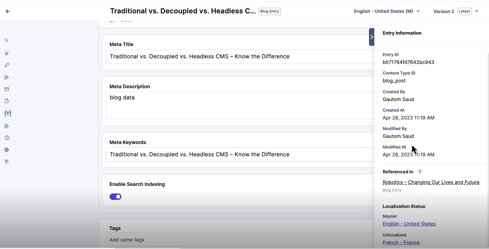

# Entries

- A specific piece of content created within a predefined content type.
- Each entry adheres to the structure and fields defined by its associated content type.
- When working with branches, entries created or updated are specific to that particular branch (isolated development).

**Example:**
A blog entry means that all the content type fields like **title**, **author**, **text**, and **assets** are filled.

---

## Entry Information

You can also get information about the entry:

> **Note:** Entry can be localized or translated.

---

## Filling an Entry

1. Click on **New Entry**
2. Select the **content type** for which you want to create the entry
3. Enter the **title** in the title field
4. The **URL slug** will be automatically created based on the rules defined
5. Fill in the other details
6. The **Reference field** helps associate other posts to this post

---
