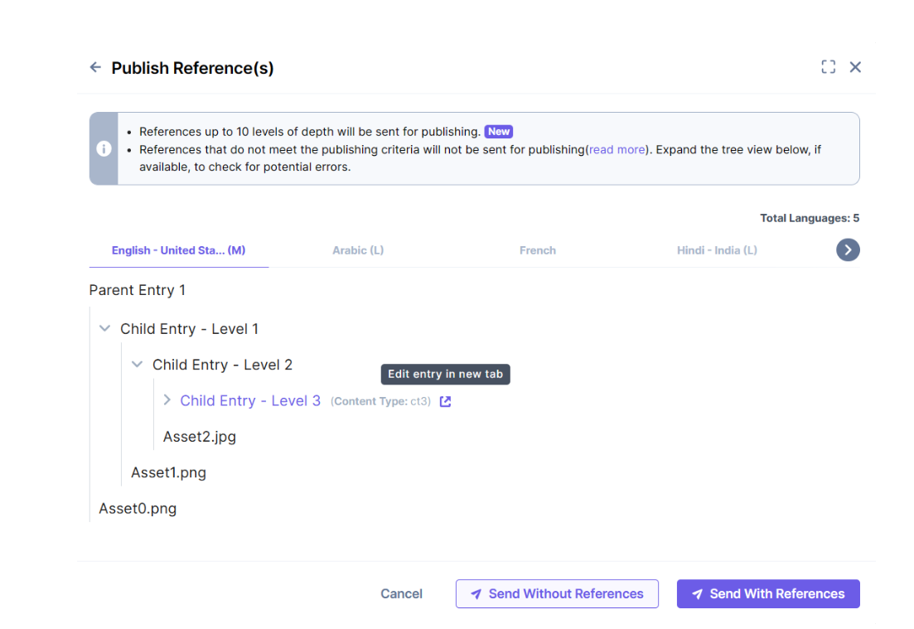

# Publish Entry

- In the **Publish Entry** modal, select the desired environments under **Select Environment(s)** and the appropriate locales under **Select Language(s)** in which the entry gets published.

> **Note:** You can select up to **10 environments** and **10 locales** for a single publishing action.
> You can choose to **publish now** or **schedule** the publishing.

---

### Reference Entries

If the referenced entries are not published yet, you can choose one of the following publishing options:

- **Publish the entry with all its references:**
  This option publishes the entry along with all its referenced entries.

- **Publish the entry without its references:**
  This option publishes only the entry itself, excluding its referenced entries.

> **Question:**
> If the entry is scheduled, and if the referenced entry is getting published before the scheduled time, then will it get scheduled?

---

### Nested Entries

- You can also publish entries with **nested entries**.
  **Example:**\
  \
  

---
