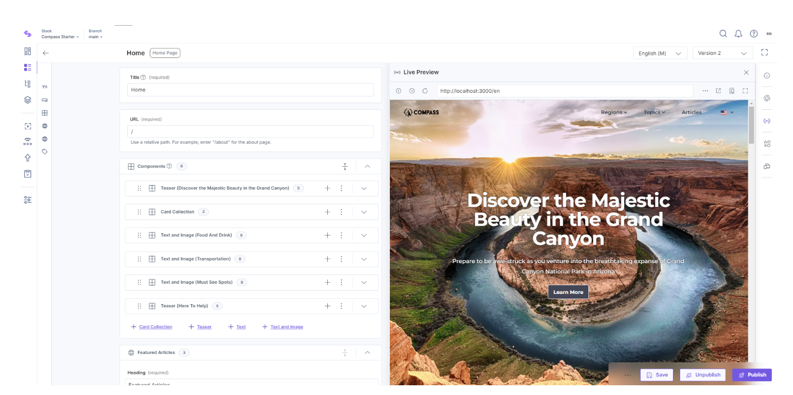
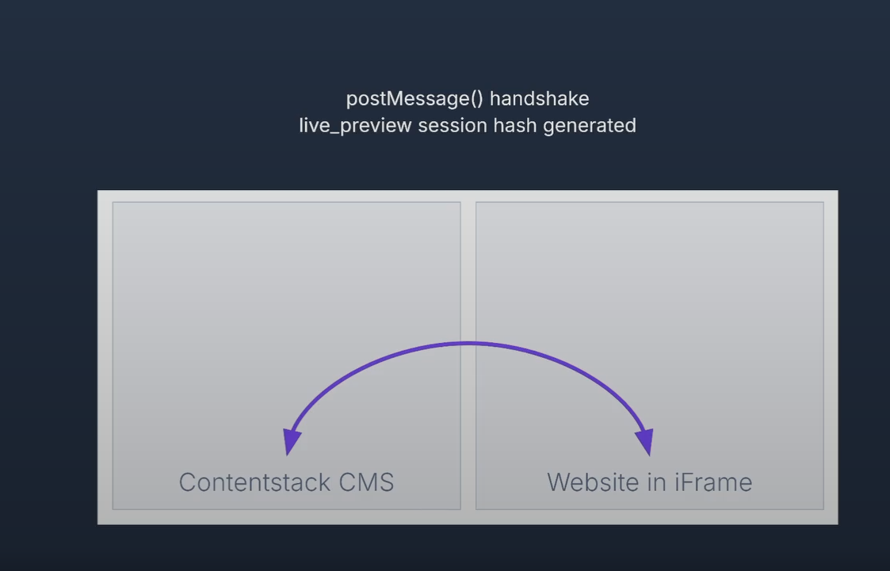
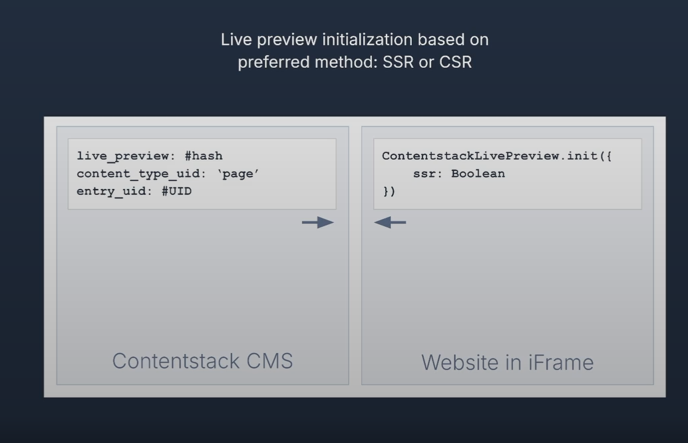
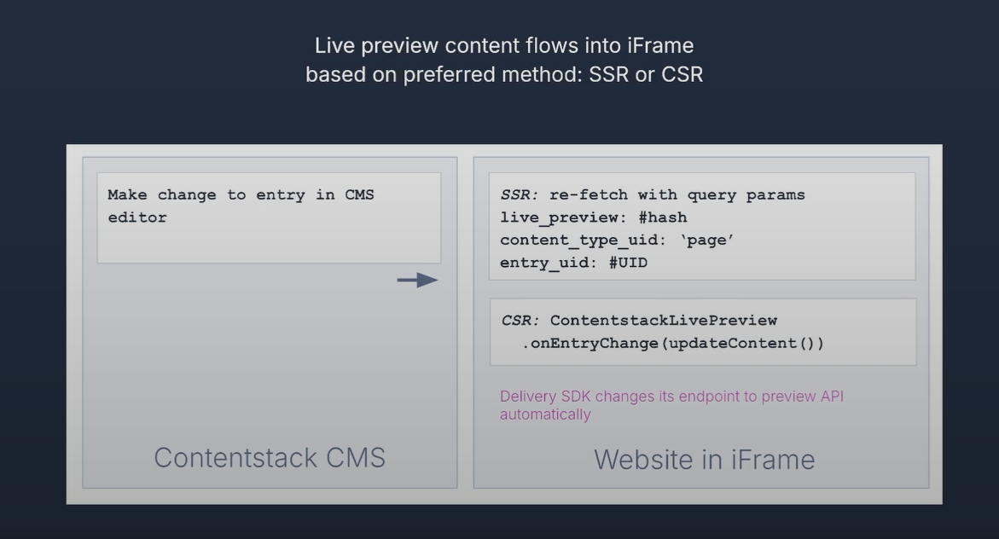

# Live Preview

With the Live Preview feature, you can seamlessly preview your content updates across multiple channels such as mobile devices, tablets, and desktops.

## How Live Preview Works Under the Hood

- The base system is also utilized for the **Builder** and **Timeline** features.
- The **Website Live Preview** is rendered inside an **iframe**.
- Communication between the CMS and the live preview is facilitated via the **postMessage() API**, which is built into modern browsers.

## 1. How Do We Initialize the Live Preview?

There are two main rendering methods for initializing the live preview:

- **SSR (Server-Side Rendering)**
- **CSR (Client-Side Rendering)**

When using the **CMS SDK** for your website, you’ll see an option to enable live preview:

- The **Live Preview Utils SDK** is always initialized on the **client side**.

## 2. What Happens After I Edit Something?

When you make changes to an entry, an event is triggered to update the live preview.

### In the Case of SSR (Server-Side Rendering):

- The system will send query parameters that include:

  - Live Preview hash
  - Content type ID
  - Entry UID (Unique Identifier)

- Using these parameters, you can instruct our **Delivery SDK** to fetch the latest draft data of the content that was just edited.

- Alternatively, if you don't want to use the SDK, you can directly use the **Live Preview API Endpoint** by providing the hash. This allows you to render content through the live preview without needing the SDK.

- This method gives you flexibility to build more customized solutions.

### In the Case of CSR (Client-Side Rendering):

- CSR automatically triggers an event when a change is made.
- You can subscribe to this event and trigger a function to handle the content update.
- Since the parameters are already known, this process happens automatically and doesn't require manual intervention.

## 3. Endpoints Involved

There are two key API endpoints involved in the live preview process:

- **Preview API Endpoint**
- **Delivery API Endpoint**

The **Delivery SDK** is always used for querying the data. The **Live Preview SDK**, on the other hand, is integrated on the client side to ensure secure communication and to fire events appropriately.

## 4. Things Live Preview Can Work With

Live Preview is versatile and can integrate with various systems, including:

- **SSR (Server-Side Rendering)**
- **CSR (Client-Side Rendering)**
- **GraphQL** (just change the endpoint accordingly)
- **Middleware** (even without the SDK). In this case, you can use the SSR approach with query parameters to handle live preview.

---
