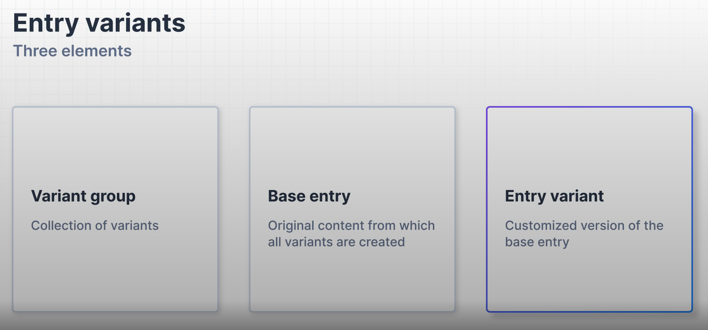

### **Three Key Elements**

1. **Variant Group**: A collection of related variants.
2. **Base Entry**: The original piece of content from which all variants are derived.
3. **Entry Variant**: A customized version of the base entry, tailored for different audiences or use cases.

   

**Note**: To link the variants to the content type, navigate to _Organization > Stack and Settings > Variants_.

---

### **Editing an Entry**

- When viewing an entry, you'll notice different variants listed at the top (similar to regions in AWS).
- By selecting a specific variant, you can modify the page for that variant alone, ensuring changes are applied only to the relevant website or audience.

---
